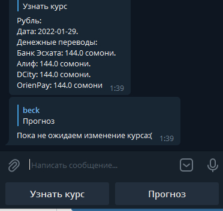

# **TelegramBot**  based on Aiogram
Hello, there! This is my first telegram bot created in aiogram.
   ``` 
   There is exist local telegram group, where everytime people were asked about
   money transfer rate of RUB/TJS. Tajikistan local currency Somoni.
   So I dicided automate this procces, to get top local banks money tranfer rate.
   Cause of the Banks don't have API, I dicided scrap web pages of banks using `requests, BeautifulSoup`.
   ```


## Requirements: 


 
 You need install all packeges from requirements.txt


### Problem that I solved

   ``` 
    There is exist local telegram group which I follow 
    and where everytime people were asked about money transfer rate of RUB/TJS. 
    It's Tajikistan local currency somoni. Everytime somebody telling for everyone who asked the rate of the currency.
    So that's why I dicided automate this procces with getting top local banks money tranfer rate.
    Cause of those Banks didn't have API, I dicided scrap web pages of banks 
    by using `requests, BeautifulSoup`. Then I created Telegram bot where people can just press the button to know ex rate of currency

   ```
### How bot and response looks like: 


>**That's all thank you for your attention!**
